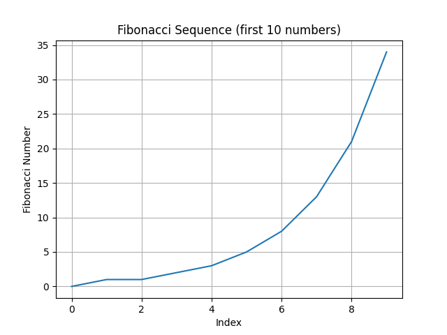

# Mini Transformer Simulation

This repository contains a minimal example of core Transformer components. The `mini_transformer_simulation.py` script generates random query, key and value vectors for a small sequence of tokens. It then computes:

- **Encoder self‑attention**: the input sequence attends to itself to produce context representations.
- **Decoder masked self‑attention**: the decoder attends only to previous tokens (future tokens are masked).
- **Cross‑attention**: the decoder’s context attends to the encoder representations.

Each of these attention matrices is saved as a heatmap using `matplotlib`. A dummy projecting head then produces probabilities over a small vocabulary, illustrating how a predicting head produces logits for the next token.

## Running the simulation

1. Install the dependencies listed in `requirements.txt`:

```bash
pip install -r requirements.txt
```

2. Execute the simulation script:

```bash
python mini_transformer_simulation.py
```

This will print the top‑5 predicted tokens and generate three PNG files:

- `encoder_self_attention.png`
- `decoder_masked_self_attention.png`
- `cross_attention.png`

These plots illustrate how attention distributions look for a tiny, randomly initialised model.


## Fibonacci demonstration

Below is an example line chart of the first 10 Fibonacci numbers, generated by the `fibonacci_chart.py` script:


